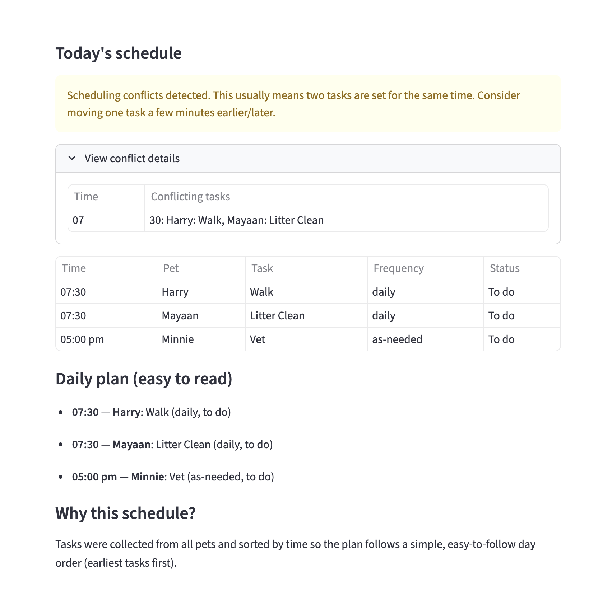

# PawPal+ (Module 2 Project)

You are building **PawPal+**, a Streamlit app that helps a pet owner plan care tasks for their pet.

## Scenario

A busy pet owner needs help staying consistent with pet care. They want an assistant that can:

- Track pet care tasks (walks, feeding, meds, enrichment, grooming, etc.)
- Consider constraints (time available, priority, owner preferences)
- Produce a daily plan and explain why it chose that plan

Your job is to design the system first (UML), then implement the logic in Python, then connect it to the Streamlit UI.

## Features

- **Add pets**: add multiple pets (name, species, age) and keep them under one owner during the app session.
- **Add pet care tasks**: add tasks for a specific pet (description, `HH:MM` time, frequency, duration, priority).
- **Schedule with constraints**: if the owner sets “time available today”, the scheduler picks higher-priority tasks first and only includes tasks that fit within the available minutes.
- **Sort tasks by time (display)**: the final schedule is displayed in `HH:MM` order so it reads like a day plan (earliest first).
- **Filtering tasks**:
  - Filter tasks by **pet name** (exact match).
  - When generating a schedule, choose whether to **include or exclude completed** tasks.
- **Task completion + recurring tasks**: when a **daily** or **weekly** task is marked complete, the next occurrence is automatically created (same description/time/duration/priority).
- **Conflict warnings**: the scheduler can warn you if multiple tasks have the exact same time (for example, two tasks at `08:00`).
- **Generate a daily schedule**: build a daily plan from all pets’ tasks, with an explanation of how it was chosen.

## 📸 Demo

Screenshot of the PawPal+ app running locally (`demo.png` lives in this folder next to `README.md`, so it renders on GitHub and in editors):



## What you will build

Your final app should:

- Let a user enter basic owner + pet info
- Let a user add/edit tasks (duration + priority at minimum)
- Generate a daily schedule/plan based on constraints and priorities
- Display the plan clearly (and ideally explain the reasoning)
- Include tests for the most important scheduling behaviors

## Smarter Scheduling

PawPal+ includes a few “smarter” scheduling features to make the daily plan easier to use:

- **Fit-to-time scheduling**: if “time available today” is set (non-zero), PawPal+ picks tasks by priority and only schedules what fits.
- **Priority**: lower number = higher priority (1 is highest).
- **Duration**: each task has a duration in minutes so the schedule can “fit” within the owner’s available minutes.
- **Sort by time (display)**: the chosen tasks are displayed in `HH:MM` order so the plan follows the day.
- **Filtering**: you can filter tasks by pet name (exact match). The schedule can optionally include completed tasks.
- **Recurring tasks**: daily/weekly tasks create a “next occurrence” when completed.
- **Conflict detection**: you’ll get warnings if multiple tasks share the exact same time.

## Getting started

### Setup

```bash
cd ai110-module2show-pawpal-starter   # if you’re starting from the Pawpal repo root
python -m venv .venv
source .venv/bin/activate  # Windows: .venv\Scripts\activate
pip install -r requirements.txt
```

### Run the app

From this same folder (`ai110-module2show-pawpal-starter`):

```bash
streamlit run app.py
```

### Suggested workflow

1. Read the scenario carefully and identify requirements and edge cases.
2. Draft a UML diagram (classes, attributes, methods, relationships).
3. Convert UML into Python class stubs (no logic yet).
4. Implement scheduling logic in small increments.
5. Add tests to verify key behaviors.
6. Connect your logic to the Streamlit UI in `app.py`.
7. Refine UML so it matches what you actually built.

## Testing PawPal+

Run tests with:

```bash
# From the repository root (parent of `ai110-module2show-pawpal-starter/`):
python -m pytest tests/ ai110-module2show-pawpal-starter/test_pawpal_system.py
```

Tests live under `tests/` (with `conftest.py` adding the starter folder to the import path). They cover sorting (time order), recurring tasks (next occurrence), conflict detection (same-time tasks), filtering by completion, and fit-to-time scheduling.

Confidence (based on current test coverage): ★★★☆☆ (3/5)
